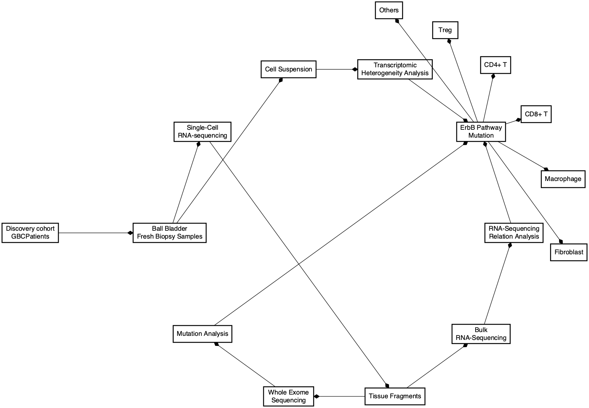

<!-- # <strong>Article to review</strong>: Single-Cell RNA-Sequencing Atlas Reveals an MDK-Dependent Immunosuppressive Environment in ErbB Pathway-Mutated Gallbladder Cancer  -->

<!-- <br> -->

Section 1 {data-width=350}
-----------------------------------------------------------------------

### Introduction

```{r eval=FALSE, include=FALSE}
readRDS("RDataRDS/annotation.rds") %>% 
  filter(section == "intro")
```

- ErbB signaling is the most extensively mutated pathway that mediates anti-tumor immunity
- Elevated ErbB-mutation levels are correlated with a worse outcome in patients with GBC.
- However, these studies generally relied on data from bulk tumor profiling, limiting their ability to accurately decipher tumor heterogeneity and genomic variations between individual cells, which are expected to contribute to tumor transformation and poor prognosis.
- Therefore, it is worthwhile to globally understand cellular heterogeneity and the intimate interactions underpinning tumor malignancy in order to develop new therapeutic approaches to improve treatment.

[Primary reference ](https://doi.org/10.1016/J.JHEP.2021.06.023), [@Zhang2021]


### Strategy
```{r include=FALSE}
readRDS("RDataRDS/annotation.rds") %>% 
  filter(section == "methods")
```


Section 2 {data-width=400}
-----------------------------------------------------------------------
### Strategy cont...

```{r include=FALSE}
library(DiagrammeR)
library(DiagrammeRsvg)

graph <- DiagrammeR::grViz("
digraph {
graph [layout = circo, rankdir = TD]

node [
shape = box, 
style = filled, 
fillcolor = white, 
fontname = Helvetica,
penwidth = 2.0] 

edge [arrowhead = diamond]

A [label = 'Discovery cohort\nGBCPatients']
B [label = 'Ball Bladder\nFresh Biopsy Samples']
C [label = 'Cell Suspension']
D [label = 'Single-Cell \nRNA-sequencing']
E [label = 'Transcriptomic \nHeterogeneity Analysis']
F [label = 'Tissue Fragments']
G [label = 'Bulk \nRNA-Sequencing']
H [label = 'RNA-Sequencing\nRelation Analysis']
I [label = 'Whole Exome \nSequencing']
J [label = 'Mutation Analysis']
K [label = 'ErbB Pathway\nMutation']
L [label = 'Fibroblast']
M [label = 'Macrophage']
N [label = 'CD8+ T']
O [label = 'CD4+ T']
P [label = 'Treg']
Q [label = 'Others']

{A} -> B
{B} -> C
{B} -> D
{C} -> E
{D} -> F
{F} -> G
{G} -> H
{F} -> I
{I} -> J
{E} -> K
{H} -> K
{J} -> K
{K} -> L
{K} -> M
{K} -> N
{K} -> O
{K} -> P
{K} -> Q


}", height = 500, width = 500)

graph

# 2. Convert to SVG, then save as png
strategy = DiagrammeRsvg::export_svg(graph)
strategy = charToRaw(strategy) # flatten
rsvg::rsvg_png(strategy, "img/strategy.png")
```


```{r mermaid, include=FALSE}
library(DiagrammeR)
library(DiagrammeRsvg)

graph <- mermaid("graph TB
A[Discovery cohort GBCPatients] --> B[Ball Bladder<br>Fresh Biopsy Samples]
B[Ball Bladder<br>Fresh Biopsy Samples] --> C[Cell Suspension]
B[Ball Bladder<br>Fresh Biopsy Samples] --> D[Single-Cell <br>RNA-sequencing]
C[Cell Suspension] --> E[Transcriptomic <br>Heterogeneity Analysis]
D --> F[Tissue Fragments]
F --> G[Bulk <br>RNA-Sequencing]
G --> H[RNA-Sequencing<br>Relation Analysis]
F --> I[hole Exome <br>Sequencing]
I --> J[Mutation Analysis]
E --> K[ErbB Pathway<br>Mutation]
H --> K
J --> K
K --> L[Fibroblast]
K --> M[Macrophage]
K --> N[CD8+ T]
K --> O[CD4+ T]
K --> P[Treg]
K --> Q[Others]

", height = 500, width = 1200)

```
```{r echo=FALSE}
graph
```


<!--  -->


Section 3 {data-width=450}
-----------------------------------------------------------------------

### Results

```{r include=FALSE}
readRDS("RDataRDS/annotation.rds") %>% 
  filter(section == "results")
```

- Consistent with these data, immunofluorescence analysis also revealed that the expression level of MDK in epithelial cells was significantly higher in representative GBC1 tissue infiltrated with more CD68+ macrophages than the GBC8 sample (Fig.
Again, 2 of the 3 cases (GBC1, 7) harbored large subcellular populations of Tregs, epithelial cells, and M2 macrophages compared to adjacent normal control tissue (Fig.
- Consistent with this data, mRNA expression levels of M2 markers were increased, but M1 markers in macrophages were decreased after treatment with MDK or conditioned media from mutated-ERBB3 GBC cells (Fig.
- Accordingly, the protein levels of M2 macrophage markers (CD163, CD206 and IL10) were induced after treatment with MDK or coculture with conditioned media from mutated-ERBB3 GBC cells (Fig.
- To define the cellular composition in the TME and subpopulation structure of GBC, we performed graph-based clustering analysis on these cells and identified 16 distinct cell types based on known marker genes or specific genes expressed by each cell type, including epithelial cell, endothelial cell_VWF, endothelial cell_DCN, myofibroblast, cancer-associated fibroblast (CAF)_MFAP5, CAF_ACTA2, mast cell, follicular B cell, plasma B cell, Treg, CD4+ T cell, CD8+ T cell, monocyte-like cell, M1 macrophage, M2 macrophage and dendritic cell (Fig.
- In GBC, 2,103 monocyte-like cells, 2,785 M1 macrophages and 5,948 M2 macrophages were identified (Fig.
- The Gini index program was subsequently engaged to identify potential secreted protein candidates and we found that CD24, midkine (MDK) and SERPINA1 were elevated in epithelial cells with ErbB pathway mutations relative to cells without ErbB pathway mutations (Gini index >0.60, Fig.
S100A7, the novel marker of squamous cell carcinoma of the lung, was not evident in gallbladder ASC (Fig.
GBC1, 2 and 7 had a relatively closer transcriptomics distance than others on the epithelial cells at uniform manifold approximation and projection space.
- Flow cytometry analysis of CD11b (pan-macrophage) and CD206 expression also supported that treatment with conditional media from mutated-ERBB3 GBC cells induced immunosuppressive macrophages.


### Graphical Results

```{r magick_magrittr_gif, fig.height=6, fig.width=8, include=FALSE}
library(magick)
library(magrittr)
list.files(path="images/", pattern = 'Screen.*.png', full.names = TRUE) %>% 
        image_read() %>% 
        image_join() %>%
        image_animate(fps=0.5) %>% 
        image_write("./images/mdk_gbc1.gif") 
```

```{r gifski_gif, eval=FALSE, fig.height=6, fig.width=8, include=FALSE}
library(gifski)
png_files <- list.files("images", pattern = "Screen.*.png", full.names = TRUE)
gifski(png_files, gif_file = "./images/mdk_gbc2.gif", width = 800, height = 600, delay = 2)
```

 
<a href=""></a>

Section 4 {data-width=250}
-----------------------------------------------------------------------

### Conclusion

```{r include=FALSE}
readRDS("RDataRDS/annotation.rds") %>% 
  filter(section == "conclusion")
```

This study has provided valuable insights into transcriptomic heterogeneity and the global cellular network in the TME, which coordinately functions to promote the progression of GBC with ErbB pathway mutations; thus, unveiling novel cellular and molecular targets for cancer therapy.

### References

```{r include=FALSE}
## Word count
paste("Total number of words for Intro, Methods, Results and Conclusion, respectively")

intro <- "Growing evidence suggests that genomic alterations acquired during oncogenesis help tumor cells to escape immune surveillance.
ErbB signaling is the most extensively mutated pathway that mediates anti-tumor immunity, and elevated ErbB-mutation levels are correlated with a worse outcome in patients with GBC.
 However, these studies generally relied on data from bulk tumor profiling, limiting their ability to accurately decipher tumor heterogeneity and genomic variations between individual cells, which are expected to contribute to tumor transformation and poor prognosis.
The median survival of patients with GBC in general is less than 1 year, highlighting the extremely poor prognosis associated with this condition.
Therefore, it is worthwhile to globally understand cellular heterogeneity and the intimate interactions underpinning tumor malignancy in order to develop new therapeutic approaches to improve treatment."

lengths(gregexpr("\\W+", intro)) + 1


methods <- "- Discovery cohort: 13 human GBCs and adjacent normal tissues
  - with or without ErbB pathway mutations
  - fresh biopsy samples from 13 primary GBC tumors and adjacent normal tissues
- Single-cell RNA-sequencing
- Bulk RNA-sequencing
 - immunohistochemical staining
 - immunofluorescence staining 
 - functional experiments
- WES analysis
  - reveal the genomic variations
- Clustering 
  - UMAP plot
- Expression analysis
  - Dot plot
Distribution/Proportion
  - Bar chart 
- Enrichment
  - Heatmap for relative enrichment"

sum((lengths(gregexpr("\\W+", methods)) + 1))

results <- "
- Consistent with these data, immunofluorescence analysis also revealed that the expression level of MDK in epithelial cells was significantly higher in representative GBC1 tissue infiltrated with more CD68+ macrophages than the GBC8 sample (Fig.
Again, 2 of the 3 cases (GBC1, 7) harbored large subcellular populations of Tregs, epithelial cells, and M2 macrophages compared to adjacent normal control tissue (Fig.
- Consistent with this data, mRNA expression levels of M2 markers were increased, but M1 markers in macrophages were decreased after treatment with MDK or conditioned media from mutated-ERBB3 GBC cells (Fig.
- Accordingly, the protein levels of M2 macrophage markers (CD163, CD206 and IL10) were induced after treatment with MDK or coculture with conditioned media from mutated-ERBB3 GBC cells (Fig.
- To define the cellular composition in the TME and subpopulation structure of GBC, we performed graph-based clustering analysis on these cells and identified 16 distinct cell types based on known marker genes or specific genes expressed by each cell type, including epithelial cell, endothelial cell_VWF, endothelial cell_DCN, myofibroblast, cancer-associated fibroblast (CAF)_MFAP5, CAF_ACTA2, mast cell, follicular B cell, plasma B cell, Treg, CD4+ T cell, CD8+ T cell, monocyte-like cell, M1 macrophage, M2 macrophage and dendritic cell (Fig.
- In GBC, 2,103 monocyte-like cells, 2,785 M1 macrophages and 5,948 M2 macrophages were identified (Fig.
- The Gini index program was subsequently engaged to identify potential secreted protein candidates and we found that CD24, midkine (MDK) and SERPINA1 were elevated in epithelial cells with ErbB pathway mutations relative to cells without ErbB pathway mutations (Gini index >0.60, Fig.
S100A7, the novel marker of squamous cell carcinoma of the lung, was not evident in gallbladder ASC (Fig.
GBC1, 2 and 7 had a relatively closer transcriptomics distance than others on the epithelial cells at uniform manifold approximation and projection space.
- Flow cytometry analysis of CD11b (pan-macrophage) and CD206 expression also supported that treatment with conditional media from mutated-ERBB3 GBC cells induced immunosuppressive macrophages."
sum((lengths(gregexpr("\\W+", results)) + 1))

conclusion <- "This study has provided valuable insights into transcriptomic heterogeneity and the global cellular network in the TME, which coordinately functions to promote the progression of GBC with ErbB pathway mutations; thus, unveiling novel cellular and molecular targets for cancer therapy"
sum((lengths(gregexpr("\\W+", conclusion)) + 1))

paste("Total= ", 
    
    (sum((lengths(gregexpr("\\W+", intro)) + 1), 
    (lengths(gregexpr("\\W+", methods)) + 1), 
    (lengths(gregexpr("\\W+", results)) + 1),
    (lengths(gregexpr("\\W+", conclusion)) + 1))))
```

