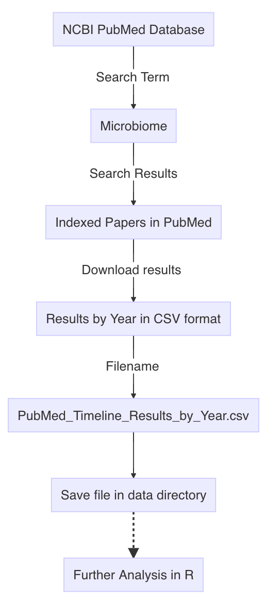

```{r setup, include=FALSE}
source("R/common.R")
library(flexdashboard)
library(tidyverse, suppressPackageStartupMessages())
```


# Pubmed Literature Tracking in R
```{r fig.cap="Microbiome Workflow", include=FALSE}
library(DiagrammeR)
library(DiagrammeRsvg)

mermaidgraph <- mermaid("graph TD
A[NCBI PubMed Database] --> |Search Term| B[Microbiome]
B --> |Search Results| C[Indexed Papers in PubMed]
C --> |Download results| D[Results by Year in CSV format]
D --> |Filename| E[PubMed_Timeline_Results_by_Year.csv]
E --> F[Save file in data directory]
F -.-> G[Further Analysis in R]

", height = 800, width = 1000)

mermaidgraph

```


<!-- <a href=""></a> -->


